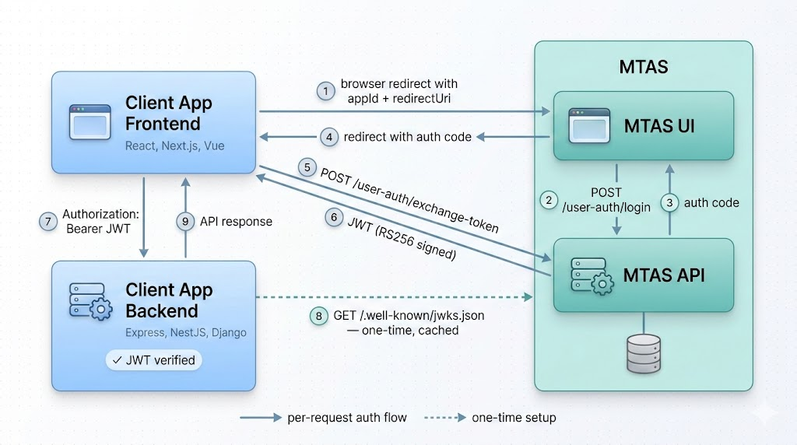

# MTAS — Multi-Tenant Auth Service

A lightweight, multi-tenant authentication broker. Register your app, redirect users to MTAS for login, and get back an RS256-signed JWT — your backend verifies it locally using the MTAS public key.

## What is MTAS

MTAS provides OAuth2-inspired auth code exchange for multi-tenant apps. Each registered app (client) gets an isolated user pool — users belong strictly to the client that registered them and are never shared across tenants. The same email can exist under different clients without conflict.

## Architecture



**MTAS** consists of two services:
- **MTAS UI** — Next.js app where users log in and clients manage their settings
- **MTAS API** — NestJS backend handling auth logic, token signing, and tenant management

**Your app** integrates as:
- **Client Frontend** — redirects users to MTAS for login, exchanges auth codes for JWTs
- **Client Backend** — fetches the MTAS public key once (via JWKS), then verifies JWTs locally

### Data Model

- **Client** — a registered tenant. Has a unique `appId` (UUID) and a whitelist of `redirectUris`
- **User** — belongs to exactly one client. Identified by `(email, clientId)` — emails are unique per tenant, not globally
- **Auth Code** — one-time use, expires in 5 minutes, ties a login to a specific `appId` and `redirectUri`

## Auth Flow

1. **Client Frontend → MTAS UI**: redirect user to `/user/login?appId=...&redirectUri=...`
2. **MTAS UI → MTAS API**: `POST /user-auth/login` with credentials, appId, redirectUri
3. **MTAS API → MTAS UI**: returns one-time auth code (5 min TTL)
4. **MTAS UI → Client Frontend**: redirects back to `redirectUri?auth_code=...`
5. **Client Frontend → MTAS API**: `POST /user-auth/exchange-token` with auth code
6. **MTAS API → Client Frontend**: returns JWT (RS256 signed)
7. **Client Frontend → Client Backend**: sends `Authorization: Bearer {JWT}` with requests
8. **Client Backend → MTAS API**: one-time fetch of `GET /.well-known/jwks.json` (cached)
9. **Client Backend**: verifies JWT signature locally — no per-request calls to MTAS

## Integration Guide

### 1. Register your app

```
POST /client-auth/register
Body: { "email": "you@example.com", "password": "..." }
```

You'll get a client account. Log in to the dashboard to find your `appId` and configure redirect URIs.

### 2. Configure redirect URIs

In the client dashboard (Overview tab), add every URL where MTAS should be allowed to redirect users back to. MTAS rejects login attempts with unregistered redirect URIs.

### 3. Frontend: redirect users to login

When a user needs to authenticate, redirect them to:

```
https://<mtas-ui-host>/user/login?appId=<your-app-id>&redirectUri=<your-callback-url>
```

MTAS handles the login UI. On success, it redirects back to your `redirectUri` with `?auth_code=<code>` appended.

### 4. Frontend: exchange code for JWT

```
POST /user-auth/exchange-token
Body: { "authCode": "<code>", "appId": "<your-app-id>", "redirectUri": "<same-uri>" }
Response: { "access_token": "<jwt>" }
```

Store the JWT (e.g. localStorage, memory) and include it in subsequent API requests.

### 5. Backend: verify JWT

Fetch the MTAS public key once and cache it:

```
GET /.well-known/jwks.json
```

Verify the JWT signature using RS256 and the returned public key. The token payload contains:

```json
{ "id": 42, "type": "user" }
```

Use the `id` to identify the user. No need to call MTAS on every request.

Libraries: `jwks-rsa` + `jsonwebtoken` (Node.js), or any JWT library that supports JWKS.

### 6. Logout

```
POST /user-auth/logout
Authorization: Bearer <jwt>
```

Clear the token from your client storage.

## API Reference

### User Auth

| Method | Endpoint | Auth | Description |
|--------|----------|------|-------------|
| POST | `/user-auth/register` | — | Register user (requires `appId`) |
| POST | `/user-auth/login` | — | Login, returns auth code |
| POST | `/user-auth/exchange-token` | — | Exchange auth code for JWT |
| GET | `/user-auth/authenticated-user` | Bearer | Get current user profile |
| POST | `/user-auth/logout` | Bearer | Logout |

### Client Auth

| Method | Endpoint | Auth | Description |
|--------|----------|------|-------------|
| POST | `/client-auth/register` | — | Register new client |
| POST | `/client-auth/login` | — | Login, sets session cookie |
| GET | `/client-auth/authenticated-client` | Cookie | Get client profile |
| POST | `/client-auth/logout` | Cookie | Logout |

### Management

| Method | Endpoint | Auth | Description |
|--------|----------|------|-------------|
| GET | `/users` | Bearer | List all users for your client |
| PATCH | `/users/:id` | Bearer | Update user name |
| PATCH | `/clients/:id` | Cookie | Update appId or redirect URIs |

### Public

| Method | Endpoint | Description |
|--------|----------|-------------|
| GET | `/.well-known/jwks.json` | RSA public key for JWT verification |

## Tech Stack

**API**: NestJS 11, TypeORM, PostgreSQL, Passport.js, JWT (RS256 for users, HS256 for clients), bcrypt

**UI**: Next.js 15, React 19, shadcn/ui, React Hook Form, Zod, TanStack Query, Tailwind CSS

**Infrastructure**: Docker Compose (PostgreSQL), Vercel (UI), Render (API)

## Running Locally

```bash
# Clone
git clone <repo-url>
cd multi-tenant-auth-service

# API
cd apps/mtas-api
cp docker.env.example docker.env   # configure PostgreSQL credentials
docker-compose up -d                # start PostgreSQL
npm install
npm run start:dev                   # runs on :5010

# UI
cd apps/mtas-ui
npm install
npm run dev                         # runs on :5011
```

Required environment variables for the API — see `.env.example` or `app.module.ts` for the full list.
